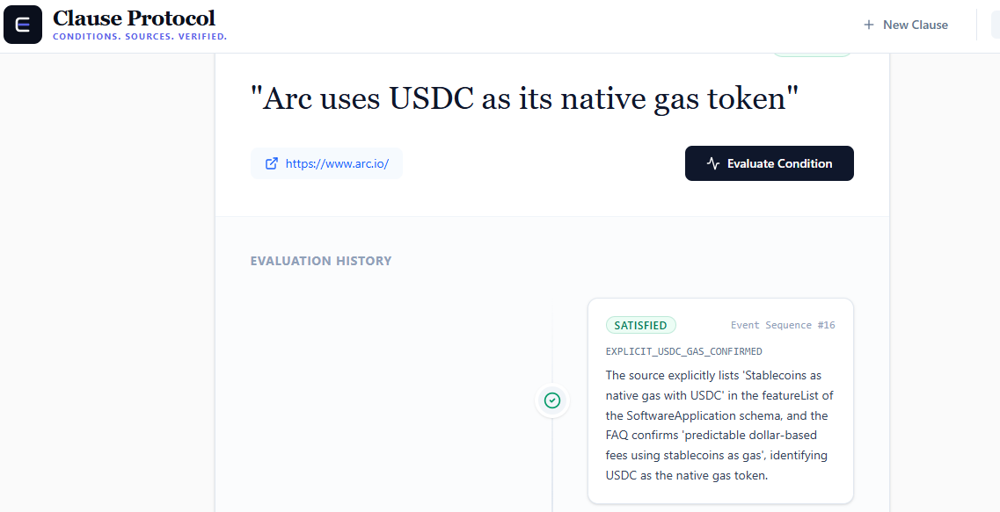

# Clause Protocol

### Persistent, source-bound conditions evaluated through GenLayer

Clause Protocol turns externally verifiable statements into persistent on-chain conditions.

A user creates a Clause containing a condition and a source URL. When the condition is evaluated, GenLayer evaluates the external source and produces an assessment that is recorded in the Clause contract.

The result can be:

- `SATISFIED`
- `UNSATISFIED`
- `UNCERTAIN`
- `MISSING_INFORMATION`

Clause is built around a simple idea:

> The condition lives on-chain. The evidence needed to evaluate it may live outside the chain.

---

## Live Application

**Live App:** https://clause-alpha.vercel.app/

**Repository:** https://github.com/ajeek/clause

**Contract:** 0x48606F48103de51ecfdCa4485dbC3c790f380551

**Explorer:** 
https://explorer-studio.genlayer.com/address/0x48606F48103de51ecfdCa4485dbC3c790f380551

https://explorer-studio.genlayer.com/tx/0x5f8faded9ac9f9e726ba88ef5aba101477d0d5525d81ca8562a6b665827cd85e

---

# What is Clause?

Clause is a GenLayer application for creating and evaluating persistent conditions that depend on external information.

A Clause contains:

```text
Condition
+
Source
+
Evaluation State
+
Evaluation History
```

For example:

```text
Condition:
Arc uses USDC as its native gas token

Source:
https://www.arc.io/

```

The condition is stored by the Clause contract.

When the user chooses **Evaluate Condition**, the contract invokes GenLayer's intelligent contract execution to evaluate the condition against the declared source.

The resulting assessment is then stored as part of the Clause state.

---

# Why GenLayer?

Clause requires information that does not originate on the blockchain.

A conventional smart contract can maintain the condition:

```text
"Arc uses USDC as its native gas token."
```

but it cannot independently inspect a public web source and determine whether the available information supports that statement.

Clause uses GenLayer for this evaluation step.

```text
User
  |
  | Create Clause
  v
Clause Contract
  |
  | condition + source
  v
GenLayer intelligent contract execution
  |
  | evaluate external information
  v
GenLayer consensus
  |
  v
Assessment
  |
  v
Clause contract state
```

This is not an AI result generated by the frontend and then written to the blockchain.

The evaluation is part of the GenLayer transaction flow, and the resulting state is read back from the contract after finalization.

---

# Core Workflow

```text
1. Create Clause
        |
        v
2. Register on-chain
        |
        v
3. Open Clause
        |
        v
4. Evaluate Condition
        |
        v
5. GenLayer evaluates external source
        |
        v
6. Transaction reaches FINALIZED
        |
        v
7. Read confirmed Clause state
        |
        v
8. Display assessment
```

The same Clause can be evaluated again when the external information may have changed.

---

# Example Evaluation

### Condition

```text
Arc uses USDC as its native gas token.
```

### Source

```text
https://www.arc.io/
```

### Result

```text
SATISFIED
```


The source contains information referring to Arc using USDC as its native gas token and supports the condition.

The important part is not the particular Arc USDC example.

The same mechanism can be applied to conditions involving:

- public announcements
- documentation
- published policies
- company information
- events
- publicly available facts
- other externally verifiable conditions

---

# Evaluation States

Clause does not force every evaluation into a simple true/false result.

| State | Meaning |
|---|---|
| `SATISFIED` | The available evidence supports the condition. |
| `UNSATISFIED` | The available evidence contradicts the condition. |
| `UNCERTAIN` | The available evidence is insufficient to establish the condition reliably. |
| `MISSING_INFORMATION` | The supplied source does not contain the information required to evaluate the condition. |

This distinction is important.

A source can be reachable while still failing to provide enough information to establish a condition.

Therefore:

```text
Source unavailable
        ≠
Condition false
```

and:

```text
Insufficient evidence
        ≠
Contradictory evidence
```

---

# Architecture

```text
┌──────────────────────────────────┐
│          Clause Frontend         │
│                                  │
│ Registry                         │
│ Create Clause                    │
│ Clause Detail                    │
│ Evaluate Condition               │
│ Final Result                     │
└────────────────┬─────────────────┘
                 │
                 │ genlayer-js
                 ▼
┌──────────────────────────────────┐
│        Clause Contract           │
│                                  │
│ Clause Registry                  │
│ Clause State                     │
│ Evaluation State                 │
│ Evaluation History               │
└────────────────┬─────────────────┘
                 │
                 │ intelligent
                 │ contract execution
                 ▼
┌──────────────────────────────────┐
│            GenLayer              │
│                                  │
│ External information evaluation  │
│ Consensus                        │
└────────────────┬─────────────────┘
                 │
                 ▼
┌──────────────────────────────────┐
│       Confirmed Contract State   │
│                                  │
│ SATISFIED                        │
│ UNSATISFIED                      │
│ UNCERTAIN                        │
│ MISSING_INFORMATION              │
└──────────────────────────────────┘
```

---

# The Clause Lifecycle

## 1. Create

The user provides the information required to create a Clause.

The transaction registers the Clause on-chain.

## 2. Register

The new Clause becomes part of the Clause registry and can be opened from the application.

## 3. Evaluate

The user requests an evaluation.

The evaluation transaction is submitted to GenLayer.

## 4. Consensus

GenLayer processes the intelligent contract execution and evaluates the external source.

## 5. Finalize

The frontend waits for the transaction to reach `FINALIZED`.

Only after finalization does the application read the confirmed Clause state.

## 6. Result

The confirmed assessment is displayed to the user and becomes part of the Clause's evaluation state/history.

---

# Contract

The Clause contract is responsible for maintaining the application's persistent state.

Core capabilities include:

### `create_clause(...)`

Creates a new Clause and registers its condition and source.

### `evaluate_clause(...)`

Requests evaluation of an existing Clause through GenLayer.

### `get_clause(clause_id)`

Returns the stored state of a Clause.

### `get_clause_history(clause_id)`

Returns the evaluation history for a Clause.

### `get_stats()`

Returns registry statistics.

The frontend does not maintain an independent authoritative copy of Clause state.

It reads the confirmed state from the contract.

---

# State Model

A Clause can be understood as:

```text
Clause
├── Identity
├── Condition
├── Source
├── Current Evaluation
└── Evaluation History
```

Evaluation history allows the same condition to be assessed more than once.

This matters because external information can change while the underlying condition remains the same.

For example:

```text
Condition
    |
    +── Evaluation 1
    |
    +── Evaluation 2
    |
    +── Evaluation 3
```

Each evaluation represents another assessment of the condition against its declared source.

---

# Event Markers

Clause uses internal event markers to track the sequence of contract events.

These markers are **sequence values, not timestamps**.

For example:

```text
Event Sequence #1
Event Sequence #2
Event Sequence #3
```

They are not interpreted by the frontend as Unix timestamps.

This keeps the UI consistent with the actual contract data model rather than presenting fabricated dates.

---

# Why Source Quality Matters

Clause evaluates the information available from the supplied source.

A source URL therefore needs to contain information relevant to the condition being evaluated.

For example:

```text
Condition:
Arc uses USDC as its native gas token.

Source:
A specific article discussing Arc's gas token
```

is more useful than:

```text
Condition:
Arc uses USDC as its native gas token.

Source:
A generic website homepage
```

A reachable URL does not automatically mean that the source contains sufficient evidence.

Clause's evaluation states make this distinction visible.

---

# Technical Implementation

### Smart Contract

```text
contracts/
└── clause.py
```

The contract maintains the Clause registry, persistent Clause state, evaluation state, and evaluation history.

### Frontend

```text
src/
├── App.tsx
├── components/
├── types.ts
└── utils.ts
```

The frontend handles:

- Clause creation
- Registry display
- Clause navigation
- Evaluation submission
- Transaction finalization
- Confirmed contract-state reads
- Result presentation

### GenLayer Integration

The frontend interacts with the GenLayer network through `genlayer-js`.

The application distinguishes transaction submission from confirmed state synchronization.

The evaluation flow is:

```text
Submit transaction
        ↓
Obtain transaction hash
        ↓
Wait for FINALIZED
        ↓
Read confirmed Clause state
        ↓
Display result
```

This prevents the UI from treating a transaction as complete merely because it has been submitted.

---

# RPC and State Synchronization

Clause includes frontend protections for GenLayer's rate-limited RPC environment.

The application:

- stabilizes React callback dependencies
- prevents initialization dependency loops
- deduplicates concurrent identical read requests
- avoids unnecessary registry reloads
- waits for finalized transaction state before synchronizing results
- separates transaction success from subsequent state-read failures

These protections are part of the frontend reliability layer and do not alter the Clause contract.

---

# Project Structure

```text
Clause/
│
├── contracts/
│   └── clause.py
│
├── src/
│   ├── components/
│   │   ├── ClauseCard.tsx
│   │   └── ClauseDetail.tsx
│   │
│   ├── App.tsx
│   ├── types.ts
│   └── utils.ts
│
├── package.json
└── README.md
```

---

# Running Locally

Install dependencies:

```bash
npm install
```

Start the development server:

```bash
npm run dev
```

Build:

```bash
npm run build
```

Lint:

```bash
npm run lint
```

---

# Development Status

Clause currently implements the complete core lifecycle:

```text
Create
  ↓
Register
  ↓
Open
  ↓
Evaluate
  ↓
GenLayer consensus
  ↓
Finalize
  ↓
Read confirmed state
  ↓
Assessment
```

The current implementation is focused on demonstrating the core Clause primitive:

> **A persistent on-chain condition whose state can be evaluated against external information through GenLayer.**

---

# Built With

- [GenLayer](https://www.genlayer.com/)
- GenLayer intelligent contracts
- `genlayer-js`
- Python
- React
- TypeScript

---

# Future Direction

Clause can be extended beyond individual evaluations toward applications where external conditions become part of programmable workflows.

Potential applications include:

- event-dependent agreements
- policy conditions
- compliance conditions
- documentation-dependent workflows
- public-information triggers
- external-state-dependent applications

The core primitive remains the same:

```text
Condition
    +
Source
    +
GenLayer evaluation
    +
Persistent on-chain state
```

---

# License

MIT
